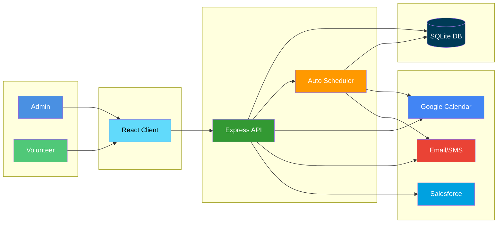

# Park Volunteer Portal - System Architecture Diagram

## Mermaid Diagram (for rendering/export to image)



## PowerPoint-Friendly Text Diagram

```
┌─────────────────────────────────────────────────────────────────────────┐
│                    PARK VOLUNTEER PORTAL SYSTEM                          │
└─────────────────────────────────────────────────────────────────────────┘

    ┌──────────────┐              ┌──────────────┐
    │ Admin Users  │              │Volunteer Users│
    └──────┬───────┘              └──────┬───────┘
           │                              │
           └──────────┬───────────────────┘
                      │
           ┌──────────▼──────────┐
           │  React/TypeScript   │
           │   Frontend Client   │
           └──────────┬──────────┘
                      │
           ┌──────────▼──────────────────────────┐
           │   Express/Node.js REST API          │
           │  ┌──────────────────────────────┐   │
           │  │ Authentication & Authorization│   │
           │  └──────────────────────────────┘   │
           │  ┌──────────────────────────────┐   │
           │  │   Cron Scheduler (Automated)  │   │
           │  └──────────────────────────────┘   │
           └──────────┬──────────────────────────┘
                      │
           ┌──────────▼──────────┐
           │   SQLite Database    │
           └──────────────────────┘

    ┌──────────────────────────────────────────────────────┐
    │              External Services                        │
    ├──────────────┬──────────────┬──────────────┬─────────┤
    │Google Calendar│  SMTP Email  │ Twilio SMS   │Salesforce│
    │     API      │   Service    │   Service    │(Optional)│
    └──────────────┴──────────────┴──────────────┴─────────┘
```

## High-Level System Overview

**Park Volunteer Portal** - Full-stack volunteer management system

### Core Components:
1. **Frontend**: React/TypeScript web application
2. **Backend**: Node.js/Express REST API with authentication
3. **Database**: SQLite for data persistence
4. **Scheduler**: Automated cron-based position posting
5. **Integrations**: Google Calendar, Email (SMTP), SMS (Twilio), Salesforce

### Key Flows:
- **Admin**: Manages templates, posts positions, schedules recurring posts
- **Volunteer**: Browses and signs up for positions, receives notifications
- **Automation**: Scheduler creates positions and forwards to Google Calendar
- **Notifications**: Email/SMS alerts based on volunteer preferences

